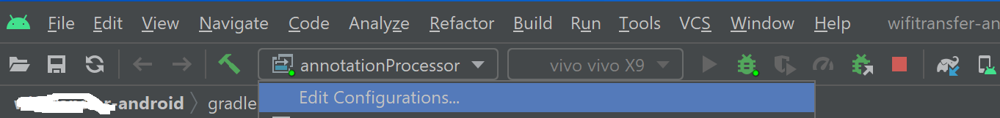
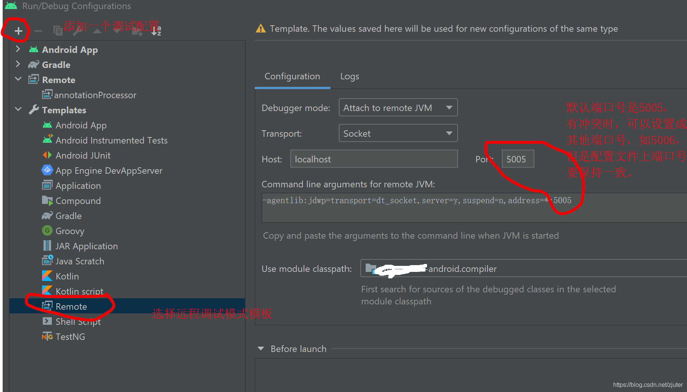
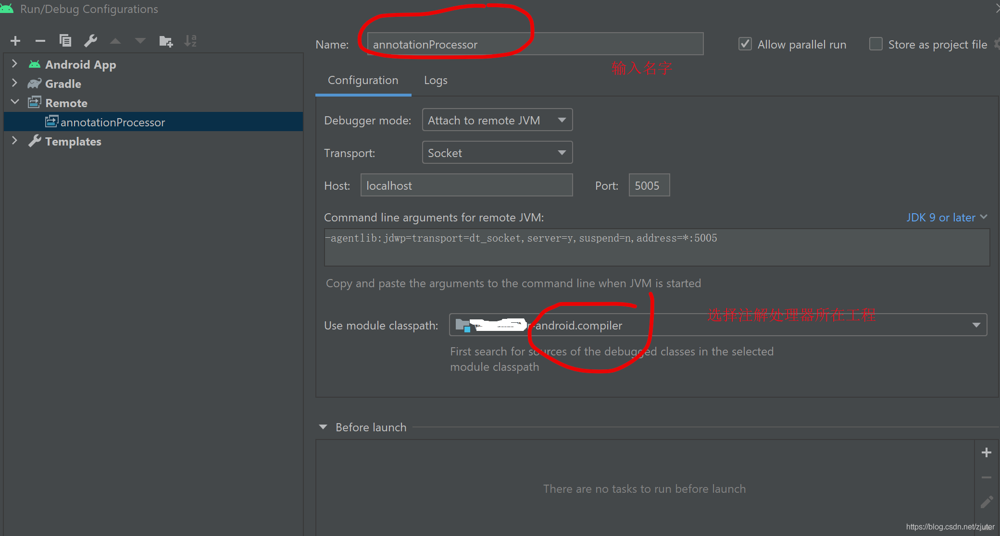

[android studio中注解处理器的调试配置](https://blog.csdn.net/zjuter/article/details/118018280)

### 

1. 在本地gradle.properties中添加：

```
org.gradle.daemon=true
org.gradle.jvmargs=-agentlib:jdwp=transport=dt_socket,server=y,suspend=n,address=5005

```

调试结束后记得删除，不然可能会影响正常调试。

2. 添加调试模式

添加入口






3. 接下来选择"annotationProcessor"做为调试模式。点击debug按钮开启调试后。clean工程， rebuild工程后，等一下，调试断点就击中了。
4. 无法调试的原因。

有一种情况是， 在用到注解的工程的build.gradle文件里，没有添加注解处理器所在工程的依赖。
比如， 你的注解处理器所在的工程名是："compiler"， 用到注解的工程是："httpServer"。那么你需要在httpServer工程中添加如下依赖：

annotationProcessor project(":compiler")

还有一种情况是没有配置需要处理的注解。下面这个方法一定要返回你的注解全名。不然别的方法执行了，而process不会执行。
@Override
public Set<String> getSupportedAnnotationTypes() {
Set<String> sets = new HashSet<String>();
sets.add(HttpService.class.getCanonicalName());
return sets;
}
